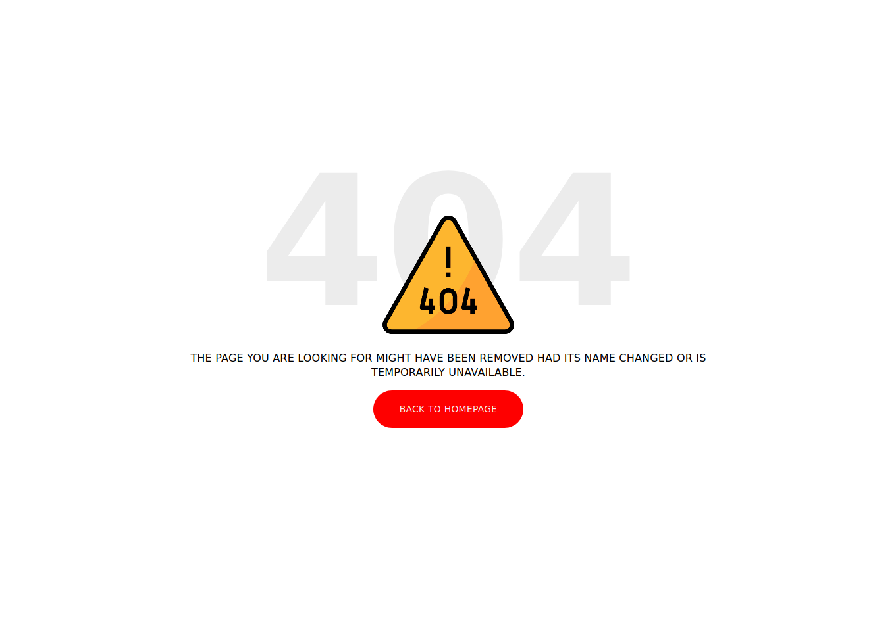

<!-- PROJECT LOGO -->
<!--  

  

 -->

# 404 Page | TastyIgniter Extension

Name: 404 Error Page Customization 
Version: 0.0.1
Components: NotFoundComponent

This extension creates a custom page in your theme to be displayed when 404 error code detected.

### Installation
Extension files path: _/extensions/babel/notfound_

      

 

Next, go to Admin -> System -> Extensions -> 404 Error Page

### Usage

Go to Admin -> System -> Settings -> 404 Error Page Settings

      

 

## Configurable Elements

      

 

#### Status
Enabled -> Create the page in themes/_pages folder
Disabled -> Delete the page in themes/_pages folder

##### Image
Choose or upload an image from Media Manager tool. (Optional) 

##### Title

##### Content
Content of the message. It does accept HTML code.

##### Button Text

##### Button Text Color
HEX format color picker

##### Button Color
HEX format color picker

##### Button URL
Home page by default (/)

##### Layout (Pending)
Currently it uses *static* layout. You can change this on the newly created page. Next version will let you choose from your active theme layouts.

<!-- CONTACT -->
## Contact

Mauricio Lattke - mauricio.lattke@gmail.com

Project Link: [https://github.com/babelattke/ti-ext-notfound](https://github.com/babelattke/ti-ext-notfound)

      

 
